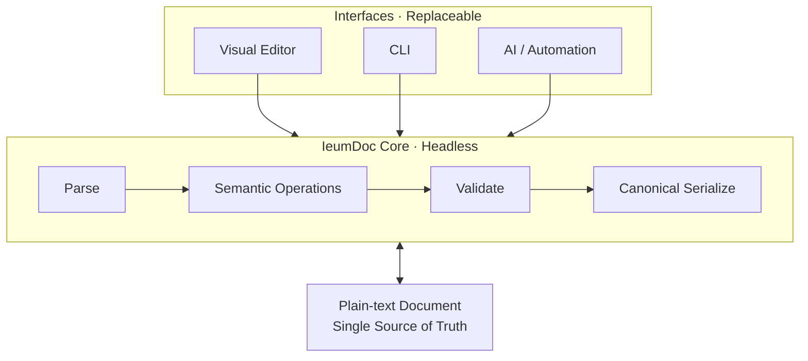

# IeumDoc

> Document first. Semantics in Core. Interfaces replaceable.

IeumDoc은 Git의 plain-text 문서를 단일 진실 공급원(SSOT)으로 사용하는 구조화 기술문서 시스템입니다.

사람은 WYSIWYG 에디터를 통해 문서를 편리하게 작성하고, CLI·AI 에이전트·자동화 도구는 동일한 headless document core를 통해 문서를 구조적으로 읽고 수정합니다.

IeumDoc은 다음을 지향합니다.

- Git에서 관리 가능한 사람이 읽을 수 있는 plain-text 문서
- 복잡한 기술문서를 위한 WYSIWYG 편집 환경
- 표, 그림, 수식, 참조, 재사용 블록 등 구조화된 콘텐츠
- Editor, CLI, AI, 자동화가 공유하는 하나의 headless core
- 신뢰할 수 있는 문서 변경을 위한 검증과 canonical serialization

IeumDoc의 목표는 또 하나의 Markdown 에디터를 만드는 것이 아닙니다.

사람에게는 편하게 작성할 수 있는 문서이고, 기계에게는 신뢰성 있게 이해하고 수정할 수 있는 문서를 만드는 것이 목표입니다.

# Goal Architecture



> Document First
> 문서가 본체다.

> Core Owns Semantics
> 문서의 의미와 변경 규칙은 Core가 책임진다.

> Interfaces Are Replaceable
> Editor, CLI, AI는 같은 Core를 사용하는 교체 가능한 인터페이스다.

> Writes Are Valid and Canonical
> 공식 경로로 저장된 문서는 항상 유효하고 안정적으로 다시 처리 가능해야 한다.

## MVP 1 Alpha

Headless document core is `packages/core`. File commands are `packages/cli`.

```bash
pnpm install
pnpm test
pnpm ieumdoc help
pnpm ieumdoc check packages/core/test/fixtures/document.md
pnpm ieumdoc inspect packages/core/test/fixtures/technical-document.md
```

Paragraph hard breaks, splits, and merges are available through Core and CLI.
Run `pnpm ieumdoc help split-paragraph` for the UTF-16 offset and snapshot-path contract.
Editor keyboard interaction for these operations is not enabled.

## MVP 2 Alpha

Visual Editor is `apps/editor`. It displays a technical document and writes changes through IeumDoc Core.

```bash
pnpm --filter @ieumdoc/editor dev
```

Open `http://localhost:5173`. The working file is `apps/editor/document/technical-document.md`.

사람이 따라 하는 절차는 [docs/test/TEST_GUIDE.md](docs/test/TEST_GUIDE.md)에 있다.


