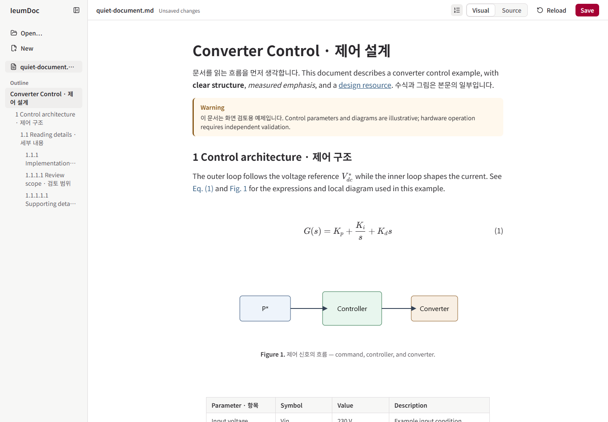
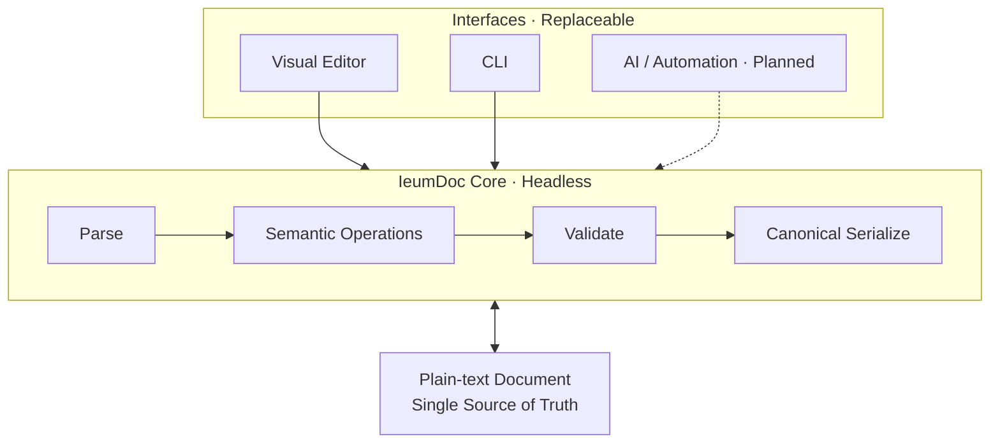

# IeumDoc

> Document first. Semantics in Core. Interfaces replaceable.
>
> **Status: Pre-alpha** — 공식 release와 installer는 없습니다. 현재 Visual Editor는 local development host로 실행하며, 공개 API·문서 지원 범위·배포 형태는 바뀔 수 있습니다.

IeumDoc은 Git의 plain-text 문서를 단일 진실 공급원(SSOT)으로 사용하는 구조화 기술문서 시스템입니다.

사람은 WYSIWYG Visual Editor로 작성하고 CLI는 동일한 headless semantic Core로 문서를 읽고 수정합니다. AI·automation도 같은 Core를 사용하도록 설계되어 있지만, 전용 AI/MCP interface는 아직 제공하지 않습니다.



2026-10-06 Visual Language v2의 실제 Editor capture입니다. 이후 추가된 Open folder와 Wide document control은 이 이미지에 포함되지 않습니다.

## Why IeumDoc

사람에게는 편하게 작성할 수 있는 문서이고, 기계에게는 신뢰성 있게 이해하고 수정할 수 있는 문서를 만드는 것이 목표입니다.

- Git에서 관리 가능한 사람이 읽을 수 있는 plain-text 문서
- 복잡한 기술문서를 위한 WYSIWYG 편집 환경
- 표, 그림, 수식, 참조 등 구조화된 콘텐츠
- Editor, CLI와 향후 AI·automation이 공유하는 하나의 headless Core
- 신뢰할 수 있는 문서 변경을 위한 검증과 canonical serialization

## Current capabilities

현재 master에 구현된 범위입니다. 블록 종류별 세부 지원 조건은 [문서 색인](docs/README.md#current-implemented-contracts)의 current contract를 따릅니다.

- **Headless Core / CLI**: parse, semantic operation, validation, canonical MyST Markdown. 공식 파일 write는 UTF-8 / LF이며 의미를 보존할 수 없으면 fail-closed로 거부합니다.
- **Visual Editor**: 하나의 Tiptap/ProseMirror 문서 상태에서 H1–H6, paragraph, nested list, quote, code, divider, standard admonition과 지원되는 inline formatting을 편집합니다. split/join, hard break, selection/clipboard, Undo/Redo, Markdown input shortcut과 block/section 이동을 지원합니다.
- **Table / Figure / Equation**: table cell·행·열·정렬, caption·label·reference, Figure 속성과 수식 편집. Figure·Equation·caption/label이 있는 Table의 번호는 계산해 표시합니다. PNG·JPEG·GIF·WebP 이미지 붙여넣기·drop은 문서 옆 `assets/`에 저장합니다([Asset Host contract](docs/design/filesystem-host-boundary-v1.md#asset-host-contract-v1-59)).
- **Heading / footnote**: heading reference와 선택 가능한 H2–H6 numbering(H1은 제목), footnote 삽입(`/` Footnote, CLI `insert-footnote`)과 한 문단 definition의 문서 내 편집. 그 밖의 definition은 block source editing으로 고칩니다.
- **Preservation / Save**: read-only 보존, block source editing, canonical Source preview, 외부 변경의 Save conflict와 미저장 작업 이탈 보호. Save 뒤에도 selection과 Undo/Redo history를 유지합니다.
- **Local file navigation**: Markdown 열기·새 파일 생성, 선택한 folder의 한 단계 목록과 하위 folder 이동, 현재 문서 Outline. workspace나 Git UI는 아닙니다.

## Architecture

현재 Editor와 CLI가 공유하는 Core와, 향후 연결할 interface의 관계입니다. 점선은 계획된 interface입니다.


```mermaid
flowchart TB
    subgraph Interfaces["Interfaces · Replaceable"]
        Editor["Visual Editor"]
        CLI["CLI"]
        AI["AI / Automation · Planned"]
    end

    subgraph Core["IeumDoc Core · Headless"]
        Parse["Parse"]
        Ops["Semantic Operations"]
        Validate["Validate"]
        Serialize["Canonical Serialize"]
    end

    Document["Plain-text Document<br/>Single Source of Truth"]

    Editor --> Core
    CLI --> Core
    AI -.-> Core

    Parse --> Ops
    Ops --> Validate
    Validate --> Serialize

    Core <--> Document
```

> Document First — 문서가 본체다.
>
> Core Owns Semantics — 문서의 의미와 변경 규칙은 Core가 책임진다.
>
> Interfaces Are Replaceable — 인터페이스 교체가 Core 의미 계약을 바꾸지 않도록 한다.
>
> Writes Are Valid and Canonical — 공식 경로로 저장된 문서는 유효하고 안정적으로 다시 처리 가능해야 한다.

Architecture decisions:

- [ADR-0001: Single-document editor architecture](docs/adr/0001-single-document-editor-architecture.md)
- [ADR-0002: Document persistence and semantic ownership](docs/adr/0002-document-persistence-semantic-ownership.md)
- [ADR-0003: Document addressing and identity boundary](docs/adr/0003-document-addressing-identity-boundary.md)

## Getting started

아래는 저장소를 clone한 뒤 사용하는 **개발 실행 절차**입니다. 일반 사용자용 설치나 배포 패키지가 아닙니다.

### Requirements

Node.js `>=24.21.0 <25`, pnpm `12.5.1`이 필요합니다. 기준은 루트 `package.json`입니다.

### Install

```bash
git clone https://github.com/ieumbird/ieumdoc.git
cd ieumdoc
pnpm install --frozen-lockfile
```

### Core and CLI

Headless document Core는 `packages/core`, 파일 명령은 `packages/cli`에 있습니다.

```bash
pnpm ieumdoc help
pnpm ieumdoc check packages/core/test/fixtures/document.md
pnpm ieumdoc inspect packages/core/test/fixtures/technical-document.md
pnpm ieumdoc help split-paragraph
```

`help <command>`에서 옵션을 확인합니다. paragraph offset은 UTF-16이고 NodePath는 snapshot locator입니다. `check`는 대상이 없는 `{eq}`/`{numref}`/`{ref}` reference를 warning으로 알립니다. 이 warning만으로 check가 실패하지는 않습니다. 파일을 바꾸는 명령은 fixture가 아닌 문서 사본에서 실행합니다. 명령이 파일을 읽은 뒤 다른 곳에서 바뀌었거나 쓰기 도중 실패하면 원본을 그대로 두고 실패합니다([File commit](docs/design/filesystem-host-boundary-v1.md#file-commit-v1)).

### Visual Editor

```bash
pnpm editor
```

`pnpm --filter @ieumdoc/editor dev`와 같습니다. `http://127.0.0.1:5173`을 열면 기본 문서는 `apps/editor/document/technical-document.md`입니다. 검증 시에는 [scratch fixture 절차](docs/test/TEST_GUIDE.md#browser-regression)를 사용합니다.

```bash
pnpm docs:check
pnpm typecheck
pnpm test
pnpm --filter @ieumdoc/editor build
```

관련 browser regression과 수동 확인은 [검증 안내](docs/test/README.md)에 있습니다.

## Document compatibility and preservation

IeumDoc은 **byte-preserving Markdown editor가 아닙니다**. 지원 가능한 Markdown/MyST를 semantic document로 읽고 공식 write path에서 canonical Markdown을 생성합니다. 파일 출력은 UTF-8이며, CRLF와 mixed EOL은 LF로 정규화합니다. formatting과 원래 bytes를 그대로 유지하는 계약은 아닙니다.

지원하지 않는 내용을 조용히 삭제하지 않습니다. 전체 문서의 의미를 canonical output으로 보존할 수 있으면 미지원 block을 read-only로 유지하면서 다른 내용을 편집할 수 있습니다. 보존할 수 없는 문서는 처음부터 read-only로 열리고, 저장은 fail-closed로 거부합니다.

**Read-only preservation**은 미지원 내용의 의미를 유지하는 것이고, **block source editing**은 쓰기 가능한 문서의 read-only block 하나를 MyST source로 수정해 Core 검증을 거쳐 Apply하는 기능입니다. 지원되는 결과는 visual editing이 가능해집니다. 문서 전체 Source는 읽기 전용 preview이며, 전체 문서가 unwritable하면 외부 editor 또는 Core-backed CLI로 고친 뒤 Reload합니다.

외부 앱의 rich HTML clipboard에는 별도 import 정책이 적용됩니다. 지원되는 구조로 붙여넣고, 보존하지 못하는 formatting은 안내하며, 표현할 수 없는 구조는 이유와 함께 거부합니다. 자세한 범위는 [Document support](docs/design/document-support-v1.md), [Block source editing](docs/design/block-source-editing-v1.md), [Continuous editing](docs/design/document-editing-v1.md)을 참고합니다.

## Project status and non-goals

공식 release·installer·packaged distribution은 아직 없습니다. `apps/editor/server`는 개발 adapter이며 제품 Host 결정이 아닙니다.

**Planned direction:** Desktop product host와 배포 형태, AI/MCP integration과 broader automation, cross-document identity, transclusion·requirement semantics는 후속 설계 대상입니다. [Desktop/VS Code spikes](docs/README.md#historical-reviews-and-spikes)는 실험 근거이며 제품 채택이나 출시를 뜻하지 않습니다.

현재 autosave, durable draft recovery, collaboration, workspace/Git 관리 UI는 제공하지 않습니다. 문서의 의미는 Core가 소유하고 인터페이스는 이를 연결한다는 원칙을 유지합니다.

## Documentation

[docs/README.md](docs/README.md)에서 Accepted ADR, current design contract, historical review와 검증 문서를 찾을 수 있습니다. 문서의 권위와 갱신 규칙은 [Documentation governance](docs/contributing/documentation-governance.md)를 따릅니다.

## Contributing

개발 환경·검증·PR 절차는 [CONTRIBUTING.md](CONTRIBUTING.md), 작업·아키텍처 제약과 AI commit provenance는 [AGENTS.md](AGENTS.md)를 먼저 읽어 주세요. [표준 issue template](https://github.com/ieumbird/ieumdoc/issues/new/choose)과 [이슈 작성 안내](docs/contributing/issues.md)를 제공합니다.

## License

[MIT License](LICENSE). 누구나 license 조건에 따라 사용·수정·재배포할 수 있습니다.
