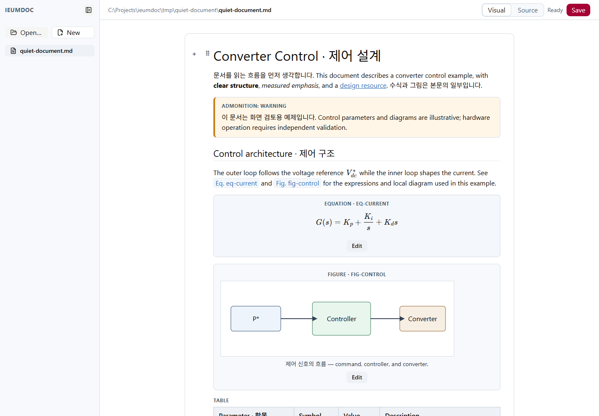
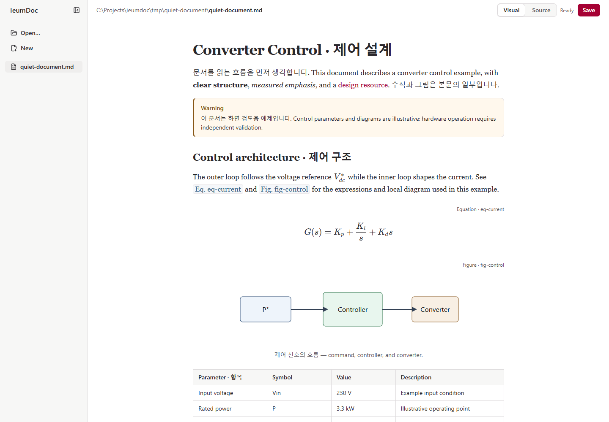
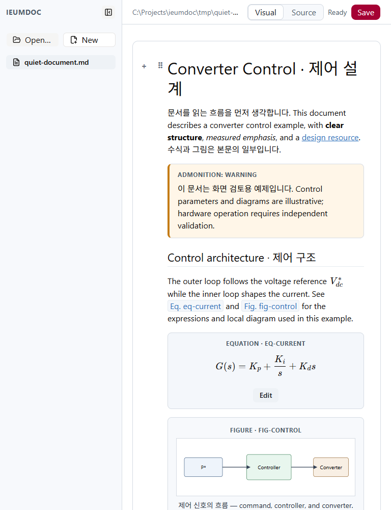
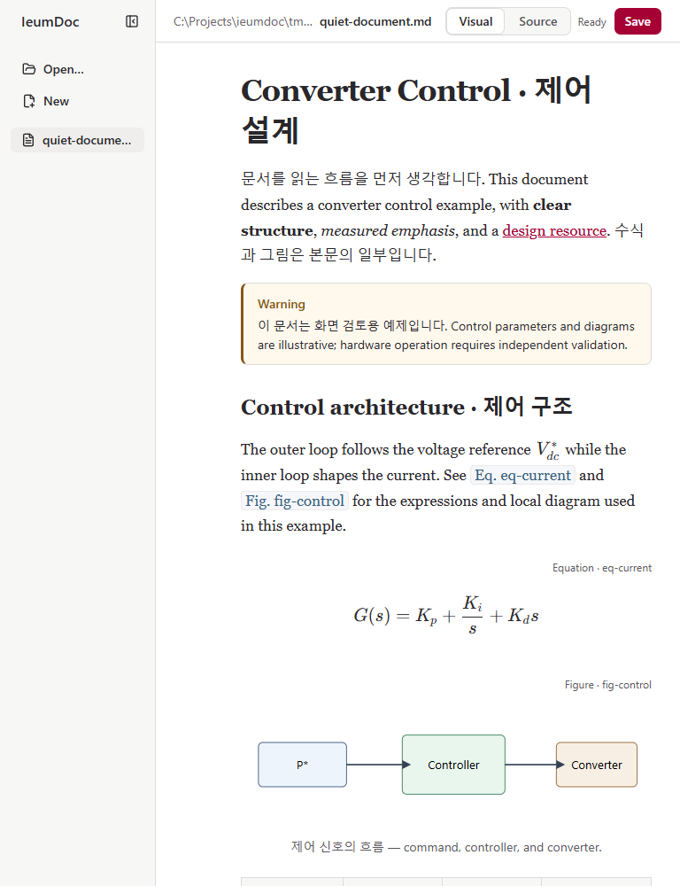
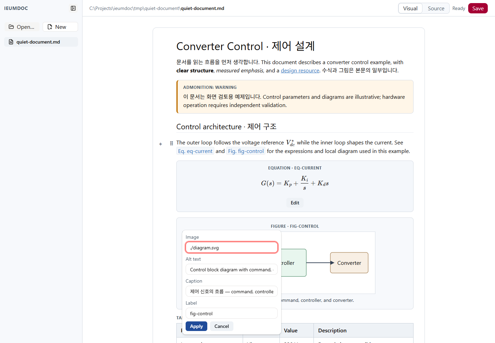
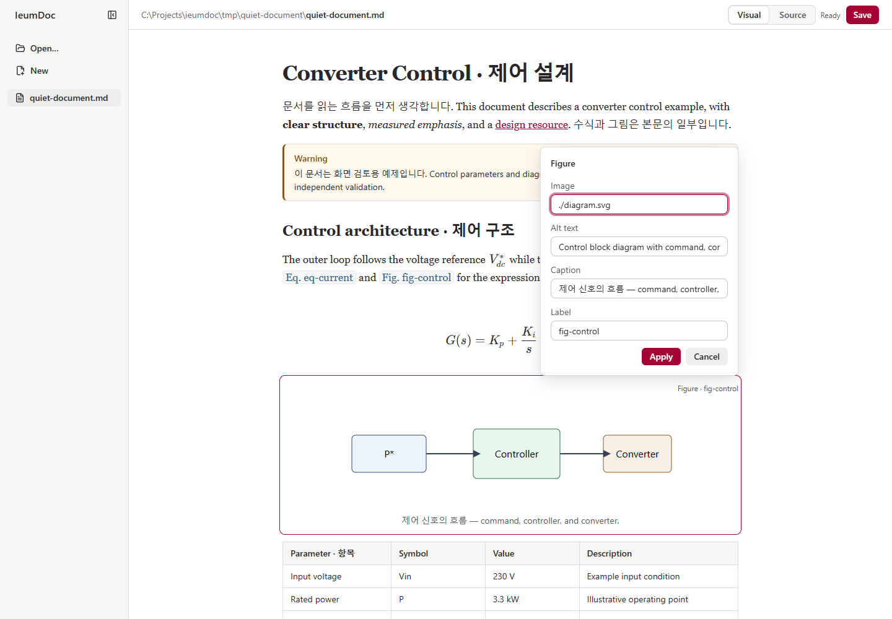
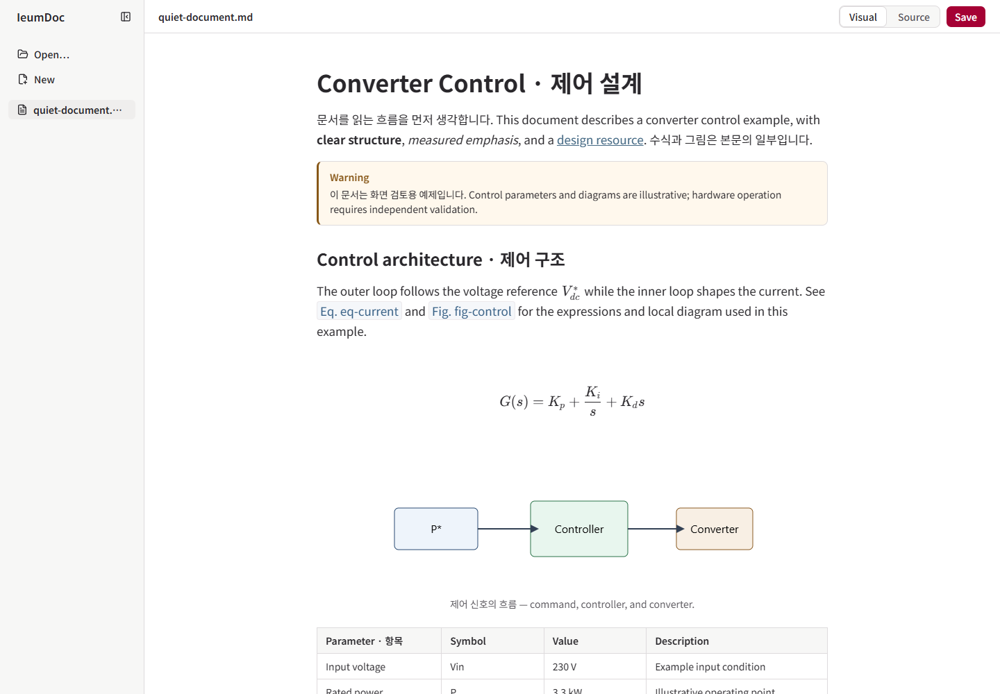
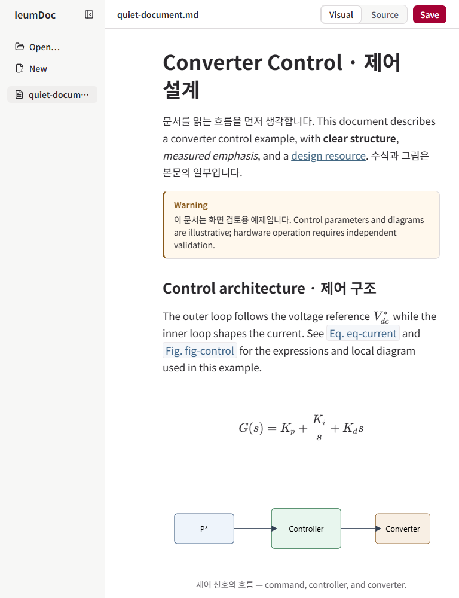
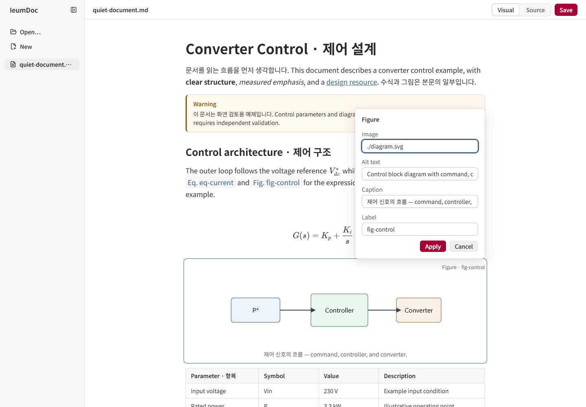

# Quiet Document v1 — visual review

- Baseline: `aaf6a5a` (latest `origin/master` at start; includes PR #27 / #28).
- Branch: `feat/editor-visual-refinement-v1`.
- Actual implementation model: `openai/gpt-6-astra`; session reasoning effort: `xhigh`.
- [Visual contract](editor-visual-language-v1.md) · [reference mockup](assets/quiet-document-reference.png).

## Same document, actual Editor

These are browser screenshots of the same `quiet-document.md` scratch file and local SVG through the real document API. All comparison pairs use 100% zoom, scroll top, the same viewport height (1000px), sidebar open, and equivalent interaction state. Fonts/images and form transitions have settled. No screenshot-only HTML or image-backed document is used.

| State | Before (`aaf6a5a`) | After |
| --- | --- | --- |
| 1440px rest |  |  |
| 768px rest |  |  |
| 1440px Figure editing |  |  |

## Observation → correction

1. Before: H1 computed at 32px / weight 400; document card plus Figure/Equation cards and always-visible Edit occupied the reading flow. At 768px the directory consumed the visible file identity. Product blue and shadcn heritage red competed; color/radius token names collided with generated Tailwind names.
2. First implementation: removed card borders, established document/UI type roles and quiet tools. Opened real screenshots at desktop/narrow widths. A left-flipping Figure popover crossed the sidebar; the selected class belonged to a NodeView wrapper, so its inner Figure outline/controls did not activate. Batang's Korean fallback was visually uneven beside the English body.
3. Correction: explicit presentation-only selected/editing attributes; end-aligned, collision-aware Figure panel; modern local Korean fallback; dismissible Figure summary while editing remains persistent. Reopened captures after correction. Viewport-bounded inline forms retain their own focus policies. A wrapper keeps the entire long formula reachable without altering KaTeX internals. Legacy Edit uses UI font explicitly.
4. Keyboard verification found StrictMode effect replay replacing a menu's return-focus target. The opener is now retained. The baseline Figure editing capture was also repeated from an isolated baseline checkout after its opening animation had settled.

## Measured result

- 1440px body: 690px → 736px; 16/24px → 17/28.9px. H1: 32px/400 → 34px/700; H1–H6 computed hierarchy verified.
- 1440/1025/1024/768/705/704px, sidebar open/collapsed: block-axis delta 0px, hover body movement 0px, gutter safety 12px, standard/compact controls 32/28px. Expanded sidebar icon/label alignment within 1px; collapsed state explicitly excludes absent labels.
- Measured normal UI text contrast: minimum 5.69:1 (directory), Save 7.91:1. Native keyboard focus, text selection and caret retained.
- Figure, Link, Inline Math, Reference, SelectionToolbar, slash menu and Open/New controls remain inside their measured surfaces/viewport after transitions, resize and scroll.
- Long formula: 881px intrinsic width; wide table: 900px. Their own blocks scroll at 1440/1024/768px; the document does not overflow. Filename remains visible, complete path remains in `title`.
- Hover-less Chromium touch context: all 20 existing block/Edit tool groups visible and interactive; Figure tap Edit/Cancel passed.

## Verification

- Editor typecheck, **143 tests**, production build passed. The existing bundle-size warning remains; no code-splitting work was added.
- Final browser sweep: **20/20 passed**, including the new visual scenario; no excluded scenarios. The final focused layout check also passed.
- Focused checks: PR #27 selection-off-Figure draft/focus and real Save → Reload; Figure invalid Apply and new/applied Cancel; label changes; Source guards; inline forms; keyboard menu return; Chromium Korean composition + undo/redo; actual block drag + undo.
- Actual external scratch-file change produced Save conflict, retained `LOCAL_CONFLICT_EDIT`, and kept the message/header inset aligned (0px delta). Existing mocked delayed-save/error/open scenarios complement real-file tests.
- Tests now hover to expose tools and compare complete path `textContent`/`title`. Cross-reference insertion explicitly positions the editor caret at paragraph end: pointer-click + End is only a visual-line end under new wrapping. No persistence/validation assertions were removed.
- An early failed mock scenario wrote canonical formatting to the default fixture after route cleanup. Restored it to the baseline; runner now retains a context-level scratch-write guard and verifies the guard with a 403 probe. Original fixture contents are unchanged. A baseline-checkout dependency cache rebuild interrupted one sweep; validation resumed against a fresh owned server after dependencies settled.

## Deliberate differences and limits

The existing diagram and technical prose are illustrative fixture content, not the mockup circuit or a validated design. Real label strings remain visible; there are no fake automatic numbers. Sidebar contains only existing functions. The existing red brand replaces the mockup's blue. Figure properties may sit above/below and overlap nearby document space when no side margin can hold a panel; they remain bounded and attached to the selected Figure. Equation stays inline. No document engine or backend changes were made.

Visual approval is the user's decision. Native Windows IME candidate UI, other browsers and OS-specific font fallbacks were not manually exercised; Chromium composition and installed Windows fonts were verified. No additional themes or future product features are proposed here.

The original v1 evidence retains the reference and six representative captures. The full local capture/log set is in repository-relative `tmp/visual-refinement/` (ignored), with `quiet-measurements.json` for the original geometry/contrast. Reproduce current captures via `pnpm browser:test layout-rules quiet-document`; see [TEST_GUIDE](../test/TEST_GUIDE.md#quiet-document-visual-review).

## Final polish — PR #29

Baseline: `b01ee41`; same fixture, viewport, zoom and scroll as above. Four presentation changes: one sans stack for both scripts/UI, authoring metadata hidden at rest, separate interaction color, and filename-first identity with truthful status. Core/CLI/API, Figure lifecycle, reference data, sidebar policy and document geometry are unchanged.

| State | PR #29 baseline | Final |
| --- | --- | --- |
| 1440px rest | [Baseline](assets/quiet-document-after-1440-rest.png) |  |
| 768px rest | [Baseline](assets/quiet-document-after-768-rest.png) |  |
| 1440px Figure editing | [Baseline](assets/quiet-document-after-1440-figure-editing.png) |  |

- **Typography:** `Pretendard Variable → Pretendard → Noto Sans KR → Apple SD Gothic Neo → Malgun Gothic → Segoe UI → sans-serif`. Browser platform-font inspection confirmed installed Noto Sans KR for the mixed H1, paragraph and caption; previously these split between Georgia/Malgun Gothic/Segoe UI. No font download, binary or package added. Pretendard packaging is deferred. Existing type sizes/weights/line heights remain; H1 negative tracking is removed. Opened 2× mixed-text detail and the complete H1–H6/caption/table document.
- **Metadata:** shared `.block-metadata` is hidden and pointer-inert at rest, visible on hover/focus/selected/editing; its reserved space prevents movement. Real labels remain in node attrs, references and forms. There are no replacement numbers.
- **Colors and correction:** initial screenshots removed the competing type textures and red selected outline, but the translucent focus halo was still faint. Corrected controls to a 2px solid blue-gray ring, then recaptured and opened desktop/narrow forms. Brand remains heritage red; interaction is `#426782` (6.01:1 against white), soft interaction `#e9f0f5`; error remains `#a12b32` with explanatory text. Outlines, focus rings and visible controls provide shape cues.
- **Shell:** only filename is visible; the complete address remains in `title`. Clean load is silent, changes/drafts show `Unsaved changes`, and `Saved` requires an actual completed save and no remaining edits. A small display callback reads the existing dirty comparison; saving/error/conflict behavior is unchanged. Verified typing after Save, undo/redo across the saved baseline, and real Save → Reload. No fake autosave wording.
- **Validation:** typecheck, 144/144 Editor tests, build and 20/20 stable browser scenarios passed. Layout checks retain all breakpoint/sidebar/geometry assertions and now check the shared font contract without requiring any installed font file. Metadata visibility and focus color checks supplement existing functional assertions. Actual external scratch-file conflict retained local input and its error UI without overflow. The existing bundle-size warning remains.

All six requested states were recaptured: 1440 rest/Figure selected/Figure editing/Equation editing and 768 rest/Figure editing. The screenshots show a shared type texture, quiet document metadata and shell, and distinct selection/focus versus errors. Only three final representative images are added. Full local baseline/detail/conflict logs are under `tmp/visual-polish/`; the runner's latest captures remain under `tmp/visual-refinement/`.

Unverified platform-specific items: Pretendard rendering where installed, macOS/system fallback variants, other browsers, native Windows IME candidate UI and screen-reader announcements. Chromium Korean composition/undo/redo and keyboard focus return passed. Final visual approval remains with the user.
