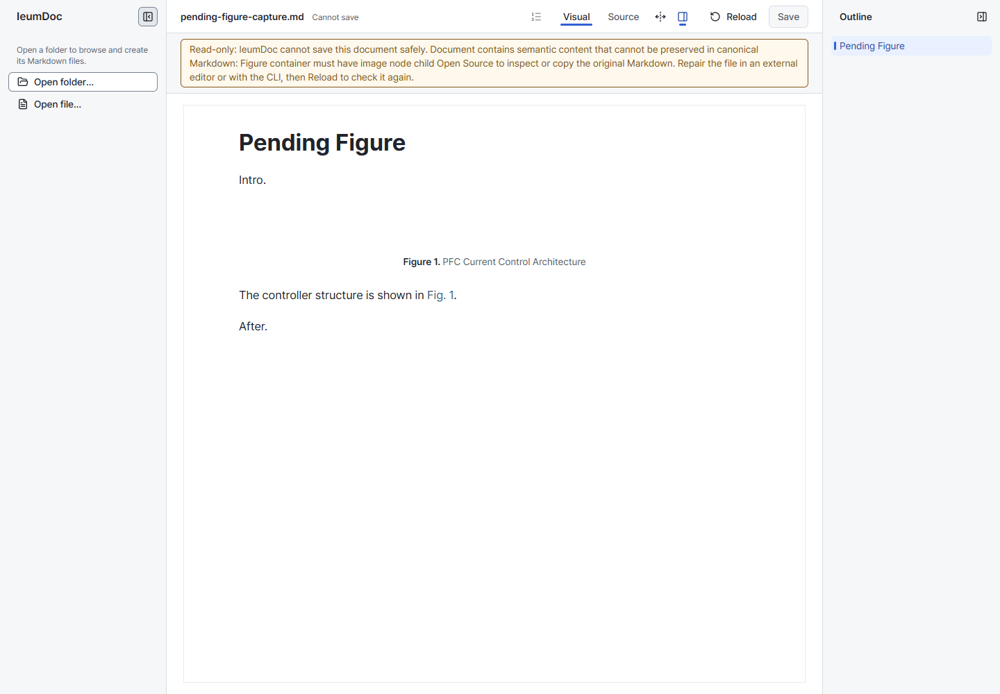
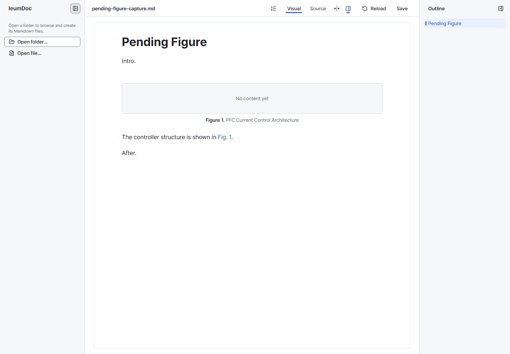

# Figure authoring v1

- Status: Implemented
- Last verified: 2026-10-10 (Core, CLI and Editor contract; verification results are recorded in the implementation PR).
- Scope: pending and image Figures, under [ADR-0002](../adr/0002-document-persistence-semantic-ownership.md), [Document support](document-support-v1.md) and [Editing session and Save](editing-session-save-v1.md).

## Scope and completion

The MVP keeps the existing MyST Figure container and image authoring UI. Completion requires real-file Save → Reload with caption, label and reference preserved, then image connection and another Save → Reload. Core owns persistence validity; CLI and Editor use the same operations. No new Media model, Mermaid authoring, upload workflow, autosave or export pipeline is introduced.

Verification covers Core canonical round-trip and fail-closed cases, CLI writes and failure without writes, Editor session collection/history, and browser Apply/Cancel, Source, Save acknowledgement and existing image authoring. The implementation PR remains unmerged for review.

## Persistent meaning

A Figure owns its caption, label, location and number. Content is optional: `contentKind` in the Core read model is `none`, `image` or `other`. Existing `imageUrl` and `imageAlt` fields remain available. Unsupported content, including Mermaid and subfigures, is never classified as empty merely because it has no image URL.

A pending Figure has no image and must have a caption or a label. Alt text requires an image. An image Figure may have neither caption nor label. Supported captions use the existing InlineContent contract. Connecting or removing an image updates the same container and preserves the label and caption. Removing an image with alt text requires clearing the alt text too.

```markdown
:::{figure}
:name: fig-pfc-control

PFC Current Control Architecture
:::

The controller structure is shown in [](#fig-pfc-control).
```

Label-only pending Figures omit the body. Caption-only Figures omit `:name:`. No fake asset, sidecar or persistent draft flag is written. Pending Figures receive normal Figure numbers and may be reference targets.

Core operations may temporarily create an empty Figure or clear a label while composing one atomic edit (including label swaps). Public `serialize` and `canonicalWriteError` validate the final state. A Figure with no image, caption or label is refused before any file replacement. The limited pending writer handles a container with no content and at most a caption; existing whole-document semantic fingerprint, reparse and serializer diagnostic guards still apply. Legends, subfigures and unsupported contents keep their existing fail-closed boundary.

## Editor session states

| State | Session behavior | Save and Source |
| --- | --- | --- |
| Transient Figure | `/figure` inserts an unapplied block. Cancel removes it. | Excluded until a valid Apply. |
| Applied pending Figure | Caption and/or label applied; shows `No content yet`, normal metadata and caption. | Included; Reload restores a Figure with no image. |
| Completed image Figure | Valid image attached; existing image behavior. | Included. |

The Editor's `applied` node attribute is session state in ProseMirror history, not MyST data. Insert starts false; Apply sets true in one undo step. Reloaded Figures and images inserted by paste/drop start applied. Dirty comparison and Save collection use the same placeholder rule. Apply → Undo returns the prior state; Redo restores the applied payload. Deleting and undoing a Figure restores its attributes.

Apply accepts label-only, caption-only and label+caption values through Core validation. All-empty values and alt without an image show a validation error and retain the form. Existing Edit Figure connects or removes the image URL. Unapplied form fields survive Save/Source and are never implicitly applied. Save acknowledges only the submitted applied snapshot; later edits remain dirty under the existing session contract.

## CLI and readiness

```bash
pnpm ieumdoc insert-figure doc.md --at 2 --label fig-pfc-control --caption "PFC Current Control Architecture"
pnpm ieumdoc insert-figure doc.md --at 2 --label fig-label-only
pnpm ieumdoc update-figure doc.md --path 2 --image ./pfc-control.svg --alt "PFC current control diagram"
pnpm ieumdoc update-figure doc.md --path 2 --image "" --alt ""
pnpm ieumdoc inspect doc.md --format json
pnpm ieumdoc check doc.md --format json
```

`insert-figure --image` is optional. `--label` uses Core label validation in the same edit and single atomic file replacement. `update-figure` preserves omitted fields and the label. Invalid final states and duplicate labels fail without writes.

`inspect` adds `contentKind` to Figure JSON and `content=none|image|other` to text. Existing fields remain. `check` reports pending Figure paths and labels in `readiness.pendingFigures`, or warnings on stderr in text mode. Existing validation/writeability/reference fields and exit codes stay intact: pending alone is writable and exits 0. This is a warning about incomplete content, not a complete publication certification; asset existence and exporters are not checked. Save and format remain allowed. Official MyST can diagnose pending Figures as errors while its build still exits 0; this MVP does not implement Publish/Export.

The prior spike remains historical evidence in [PR #150](https://github.com/ieumbird/ieumdoc/pull/150); its experimental code is not merged here. Missing-target diagnosis for `[](#label)` remains a separate existing gap tracked in [#151](https://github.com/ieumbird/ieumdoc/issues/151). Role references keep their existing diagnosis. This MVP preserves both reference forms in canonical source and uses the existing numbered role-reference UI.

## Visual verification

The same pending Markdown was opened at master `252de5c` and with this implementation in Chrome (1440×1000, DPR 1, zoom 1, same profile and preferences). Before, canonical preflight made the document read-only; after, the pending Figure is editable and visibly incomplete. Both retain caption and `Figure 1`. The new frame uses existing muted text/surface tokens and a dashed boundary; no global control style or document typography changes.

| Before | After |
| --- | --- |
|  |  |

Screenshots are manual presentation evidence. The `pending-figure` browser regression separately proves actual Apply/Source/history/Save/Reload and subsequent image connection; `layout-rules` and `quiet-document` check existing geometry and typography.
