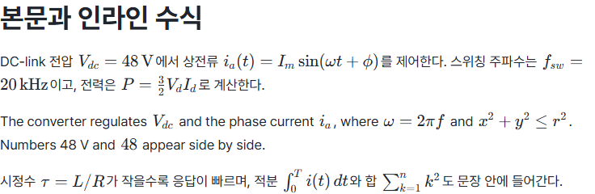
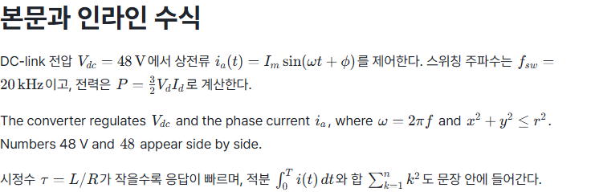

# Inline math size verification

- Status: Historical
- Last verified: 2026-10-09 (Windows Chromium, bundled Pretendard, same-state captures and DOM measurement).
- Authority: evidence for the inline math size; current contract is [Visual Language](../design/editor-visual-language-v1.md).
- Scope: Editor presentation of inline math only. Display equations, KaTeX internals, Core/CLI semantics and Markdown are unchanged. No CLI command is needed for presentation.

## Change

KaTeX's own stylesheet sets `.katex` to 1.21em. Beside 17px Pretendard body text that is 20.6px, and the formulas read visibly larger and lighter than their sentence. Inline math now takes `--math-inline-size` (1.1em, 18.7px) of its text. KaTeX lays out a formula in em from that one size, so the formula scales as a whole. The unused `--font-family-math` token was removed; KaTeX always used its own fonts.

## Measurement

Same scratch document (Korean and English sentences with subscripts, a fraction, an integral and a sum), 1440×1000, DPR 2, scroll top, fonts loaded. Candidate sizes were set through the token on the same page.

| Size | Inline math | Paragraph with ∫ and ∑ limits |
| --- | --- | --- |
| 1.21em (KaTeX default) | 20.6px | one line 30.2px (line height 28.9px) |
| 1.12em | 19.0px | 28.9px |
| 1.1em (chosen) | 18.7px | 28.9px |
| 1.05em | 17.9px | 28.9px; subscripts such as `f_sw` become hard to read |

Paragraphs with a fraction kept their line height at every size. 1.1em was chosen by the user from these captures.

| Before (`12c8796`) | After |
| --- | --- |
|  |  |

`pnpm browser:test quiet-document --screenshots` was also captured on the clean base and after the change: only the inline `V_{dc}^{*}` changes size; the display equation, wrapping and layout are identical.

## Test click points

KaTeX also emits visually hidden MathML in a 1px box. Playwright clicks the centre of an element's first box, which was that 1px box. At 1.21em it happened to fall inside the formula; at 1.1em it falls on the paragraph above. Users click the visible formula, whose centre hit-tests inside it at both sizes. Browser tests now click `.katex-html`, the visible formula. `writeability-preflight` asserted that a click on read-only inline math opens no form, so a missed click had passed silently there.

## Verification boundary

Passed: `layout-rules`, `quiet-document` (including a new check that inline math follows `--math-inline-size`), `inline-math-authoring`, `inline-math-split`, `writeability-preflight`, and the before/after captures above. Full unit/browser and required CI results are recorded in the PR. macOS, Firefox and Safari were not tested.
