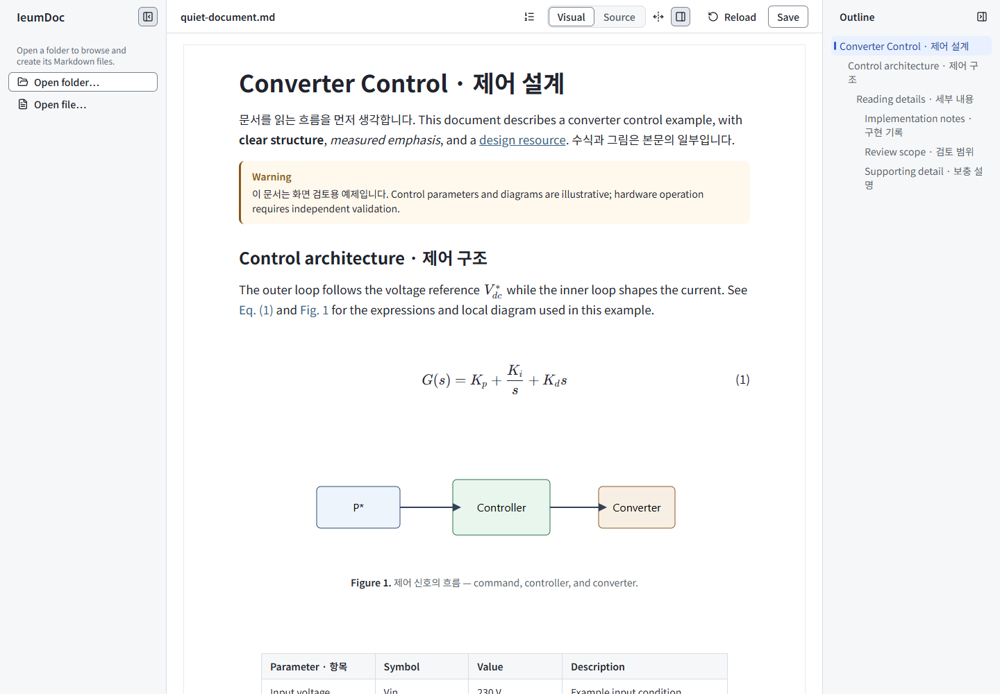
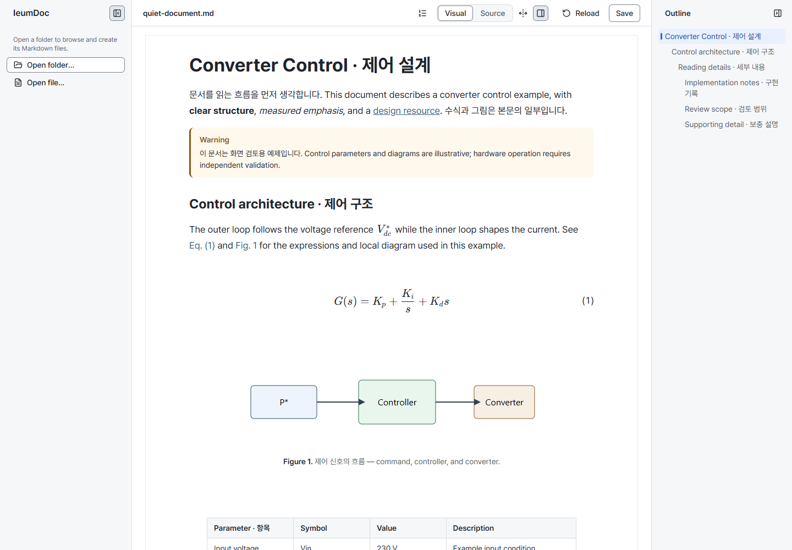
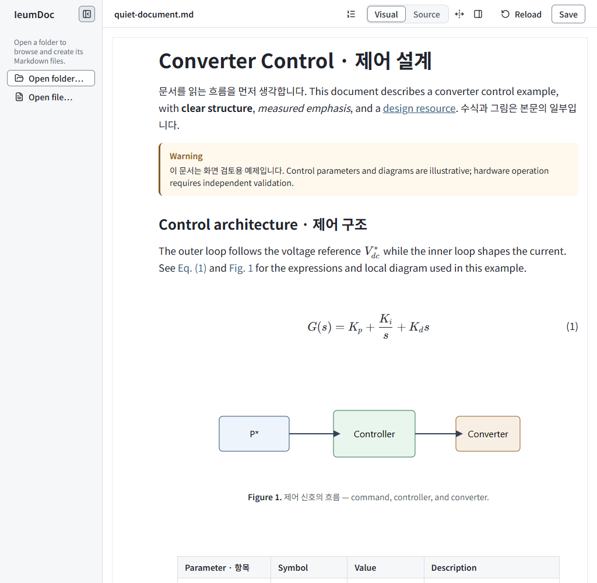
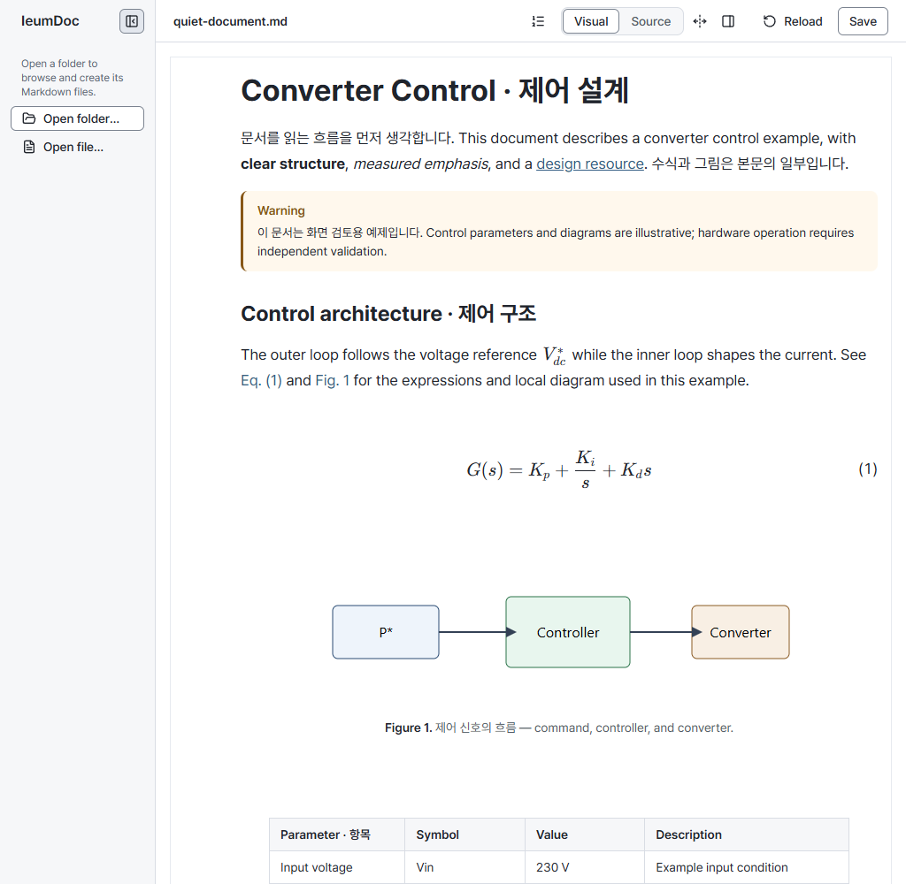
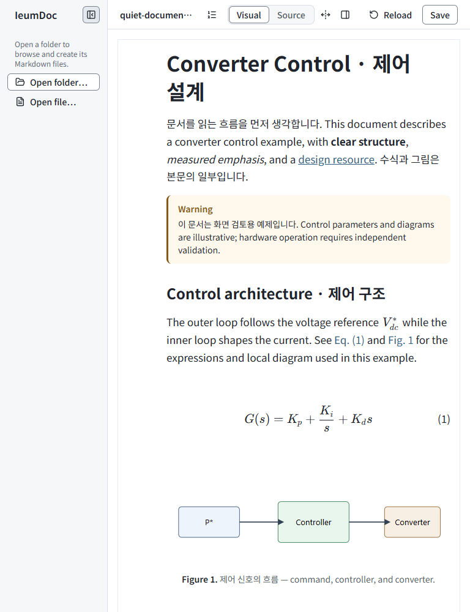
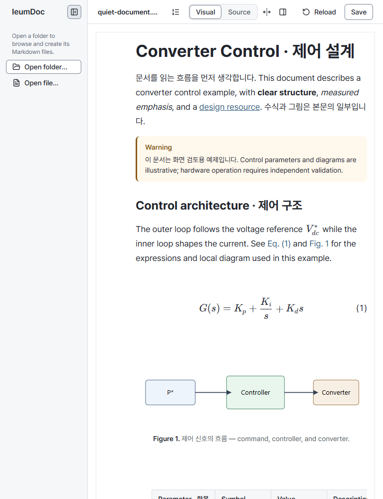
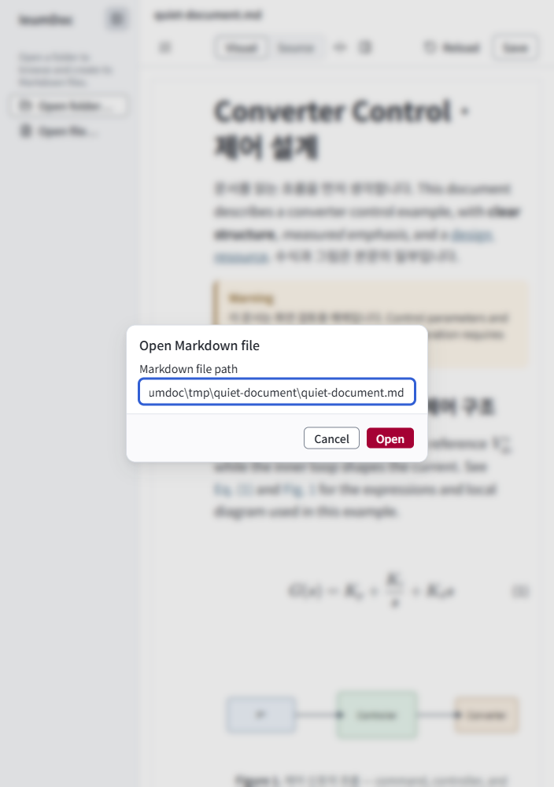
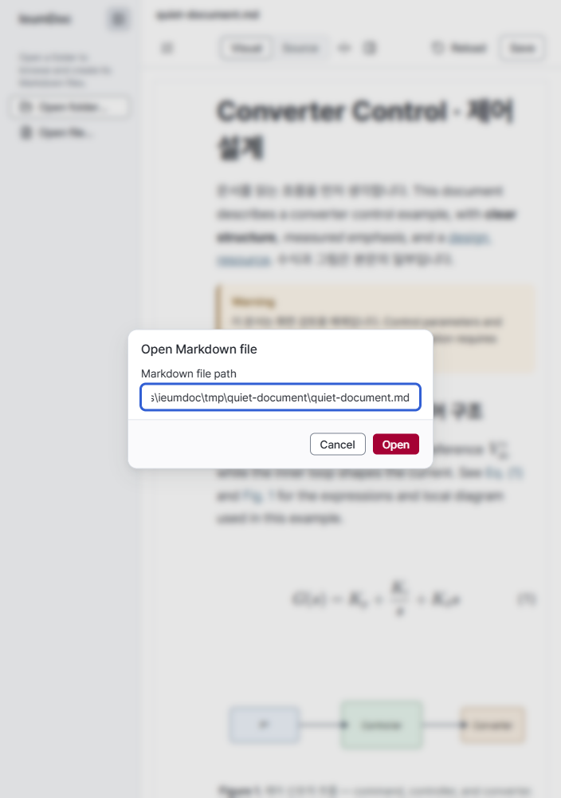

# Pretendard self-hosting verification

- Status: Historical
- Last verified: 2026-10-09 (Windows Chromium, actual glyph fonts, responsive captures and production assets).
- Authority: evidence for [issue #137](https://github.com/ieumbird/ieumdoc/issues/137); current contract is [Visual Language](../design/editor-visual-language-v1.md).
- Scope: Editor font delivery. Core/CLI semantics, KaTeX, code fonts, font sizes, line heights and layout dimensions are unchanged. No CLI command is needed for presentation assets.

## Delivery and actual use

The official `pretendard@1.3.9` package supplies variable dynamic-subset CSS with relative WOFF2 URLs. Vite bundles these as local assets; no runtime font CDN is needed. The complete upstream subset set remains available for new input. The package has no runtime dependencies. Its OFL notice (only trailing whitespace normalized) is included in `public/licenses/Pretendard-OFL.txt` and copied into the production output.

Before: clean master `ec8002e`, with installed Noto Sans KR actually rendering the mixed Korean/Latin heading, paragraph and Save label. After: Chrome DevTools Protocol `CSS.getPlatformFontsForNode` reports **Pretendard Variable**, `isCustomFont: true`, for those same nodes, including normal, bold and medium faces. `quiet-document` now asserts these actual glyph fonts instead of relying on the CSS family list. Existing layout/overlay tests supply the geometry coverage; their criteria are unchanged.

The production build emits 92 Pretendard WOFF2 files totaling 2,957,724 bytes. This is the available asset set, not the initial download. In a cache-disabled production-preview probe, opening the sample and entering `새 입력 똠힣 ABC 123` fetched 12 Pretendard subsets totaling 329,084 encoded body bytes. Every font URL was on the app's `/assets/` path. External requests were blocked and none were attempted; the newly entered Hangul also used the custom font. The license returned HTTP 200 and matched the package notice text after whitespace normalization. The preview's document API was forwarded to the existing development Host solely for this probe; this is not a new production backend.

The dependency audit before and after has the same advisory IDs and counts (1 low, 9 moderate, 5 high). Pretendard introduces no advisory or runtime dependency; existing advisories are outside this font-delivery change.

## Wrapping and review images

Windows Chromium, 100% zoom, DPR 1, height 1000px, sidebar open, scroll top, fonts/images loaded, same real `quiet-document.md` scratch file. Images below are real product captures. Narrow Figure forms and the standard capture set were also reviewed locally.

| Viewport width | Heading lines before → after | First paragraph lines before → after | Header height before → after |
| --- | --- | --- | --- |
| 1440 | 1 → 1 | 2 → 2 | 48px → 48px |
| 1024 | 1 → 1 | 3 → 2 | 48px → 48px |
| 768 | 2 → 1 | 4 → 4 | 48px → 48px |
| 704 | 2 → 2 | 4 → 4 | 85px → 85px |

There was no document-wide horizontal overflow at these widths. Wrapping changes because glyph advances differ; identical line endings are not a requirement. Existing Korean syllable-break behavior is retained. The long filename remains ellipsized with its full path available; Open and Figure controls remain reachable without clipping.

| State | Before | After |
| --- | --- | --- |
| Document 1440px |  |  |
| Document 1024px |  |  |
| Document 768px |  |  |
| Open dialog 704px |  |  |

## Verification boundary

Passed: frozen install; production build; `pnpm browser:test layout-rules quiet-document visual-states folder-navigation`; before/after `pnpm browser:test quiet-document --screenshots`; actual-font and production delivery probes above. Existing build chunk-size warnings remain. Full unit/browser and required CI results are recorded in the PR.

Local scripts, measurements and complete captures are under ignored `tmp/pretendard/`. Physical IME candidate windows, macOS, Firefox and Safari were not tested. The upstream `font-display: swap` is retained, so fallback-to-font layout movement during loading is possible; no zero-layout-shift claim is made.
