# Static UI v3 visual verification

- Status: Historical
- Last verified: 2026-10-08 (actual Windows Chromium captures and DOM measurements; final checks recorded below).
- Authority: evidence from this change, not a new requirement. Current rules: [Visual Language v3](../design/editor-visual-language-v1.md), [Layout Rules](../design/editor-layout-rules-v1.md), [UX Shell](../design/editor-ux-shell-v1.md).

## Baseline and scope

Requested review base: `e46b0ece5d5772ad88f9dc996fe8439f89512611`. The checkout and fetched `origin/master` were both `bf41fe8d6737f8bb86abfabe69d62e9aaa114ea4`, with no existing local changes. The intervening PR #134 added the empty-document starting hint, New focus handoff and content-resize-aware block controls. Those behaviors are preserved. Before captures were taken from this clean, running HEAD **before** changing product code. No mockup, CSS state study or old capture is presented as this Before.

The implementation plan was to keep the existing geometry and document engine, separate state/role tokens, align the two control families, then check actual combined states and all existing regressions. Scope is presentation plus visible/associated form labels and validation appearance. No Core, CLI, Host/API, canonical Markdown, saved/dirty decision, editor lifecycle, dependency, font download or motion change.

## Findings and changes

| Actual finding | Change | Observed result |
| --- | --- | --- |
| File current and another file's hover both computed to `rgb(239,238,237)`; current only added darker semibold text | Shared file/Outline selected, selected-hover, selected text and 3px vertical marker | A hovered alternative and keyboard focus remain distinct from current. Current+hover keeps its marker; current+focus keeps both marker and ring. No row/text geometry shift |
| Panel, Ghost hover and open-menu trigger all computed to `rgb(247,247,246)` | Separate neutral hover and neutral pressed/open face with a control boundary | `+` hover is visible on the panel; open `⋯` stays identifiable after pointer exit |
| Native secondary controls used a filled gray face while Base UI controls had different radius/focus treatments | Shared white secondary face, control boundary, 6px radius, 32/28px targets and 16px icon slots | Cancel, Edit, toolbar icons and shell controls read consistently without changing their refs or event policies |
| TopBar actions shared one spacing rhythm | 12px group gaps / 4px within settings, view and file groups; neutral outlined active view segment | Same action order, more distinct group roles; status changes still move controls by 0px |
| Weak field boundaries and labels | Separate `border-control`, white fields, visible Open/Folder labels, consistent label/helper type; invalid New name gets a danger border independently of focus | Fields remain recognizable on white overlays. Unsaved-work/Host failures keep operation messages rather than labeling valid input invalid |
| CSS stack alone did not establish the rendered font | CDP `CSS.getPlatformFontsForNode` on product name, mixed-language Outline, H1 and paragraph | Installed Noto Sans KR rendered English and Korean; normal, bold and semibold faces observed. No Pretendard claim or new font dependency |
| Actual Equation preview error appeared neutral because normal preview colors overrode the error Notice | Exclude error Notices from the normal preview surface rule | Original error message retains the shared danger surface, text and border; KaTeX internals remain unchanged |
| Read-only Save remained visually enabled: focusable Base UI controls expose `aria-disabled`, not native `:disabled` | Add a muted disabled face/text/boundary without removing pointer access or focus | Disabled Save is recognizable and its explanatory tooltip and focus ring remain available |

The initial palette candidates were adjusted using actual roles: `#868e9b` would be only 2.66:1 on the pressed surface, so control boundaries use `#7b8390` (3.08:1 there). Metadata uses `#606874`, retaining 4.54:1 even on that face. The white paper, existing subtle inset edge, body 17px/1.7, UI 14px/20px and metadata 12px/16px remain.

## Actual product comparisons

All pairs use the same scratch document, viewport height 1000px, DPR 1, browser zoom/visualViewport scale 1, scroll and interaction state. Windows Chromium 154, same installed fonts, fonts/images loaded and existing transitions settled. These are complete app screenshots, not reconstructed components.

| State | Before (`bf41fe8`) | After |
| --- | --- | --- |
| Current file A, hovered B; 1440px | 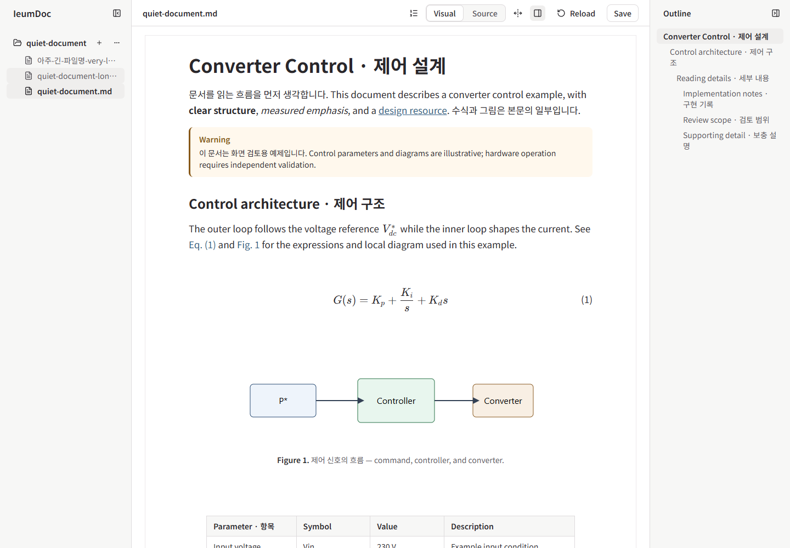 | 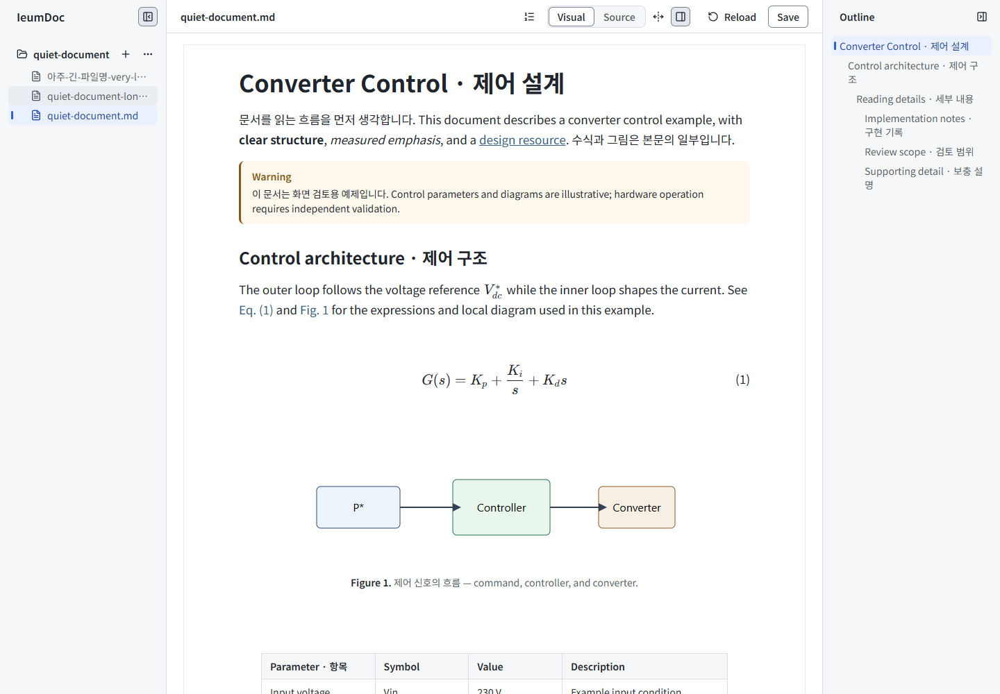 |
| Current file A, keyboard focus B; 1440px | 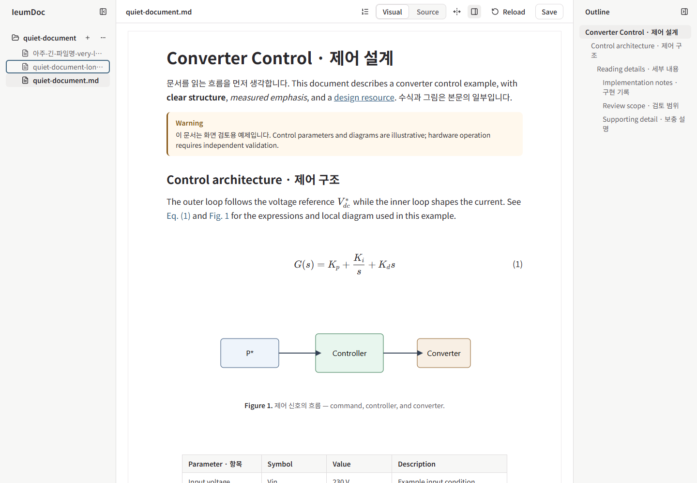 | 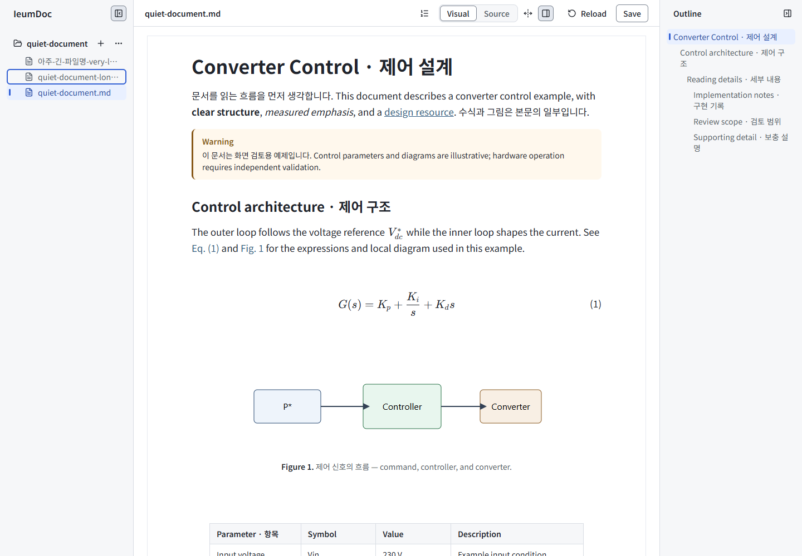 |
| Folder menu open; 1440px | 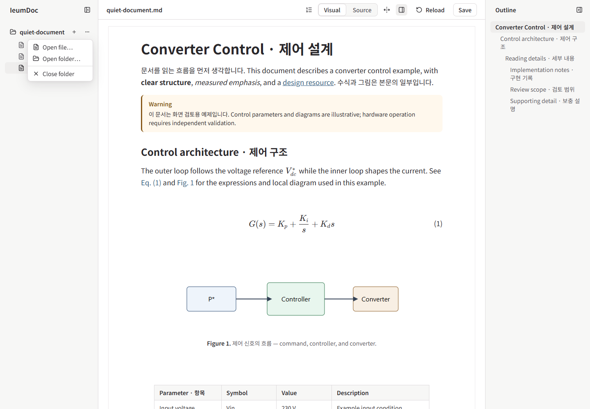 | 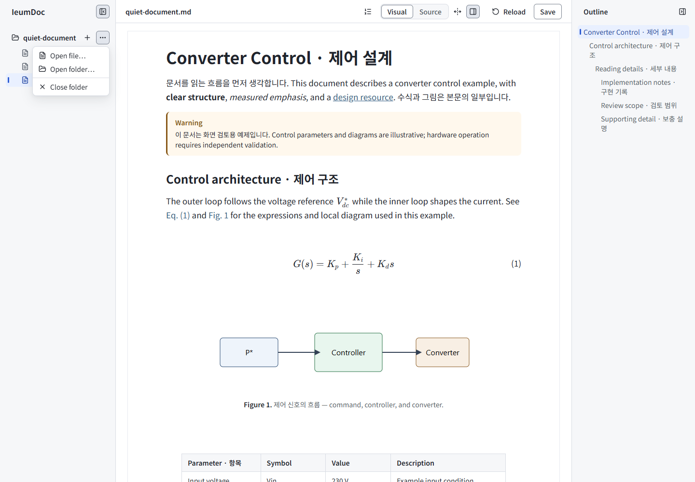 |
| Invalid New name; 1440px | 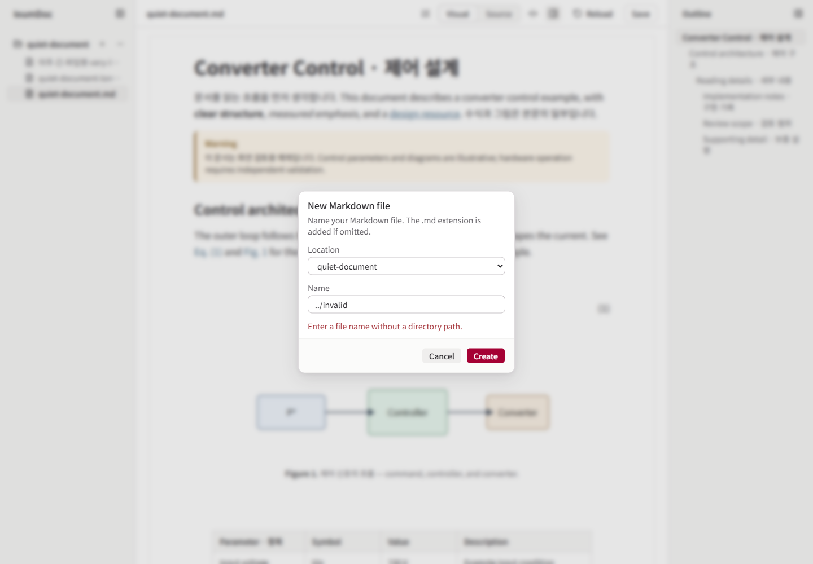 | 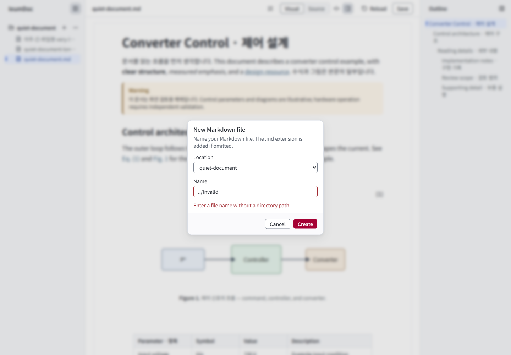 |
| Folder and clean document; 1024px | 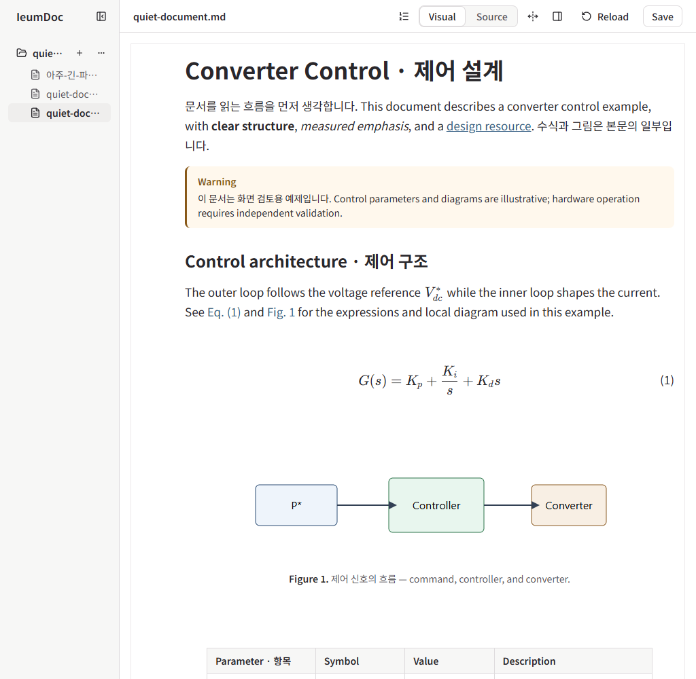 | 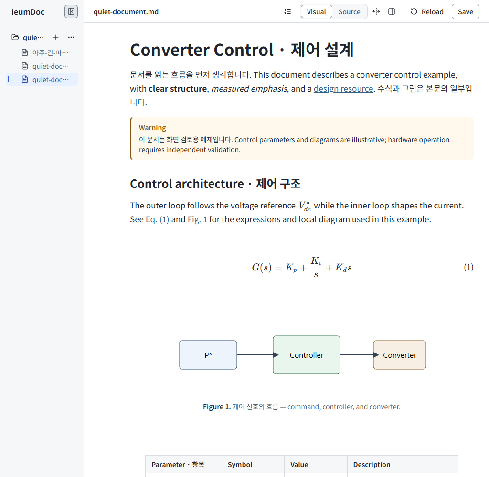 |
| Outline overlay; 768px | 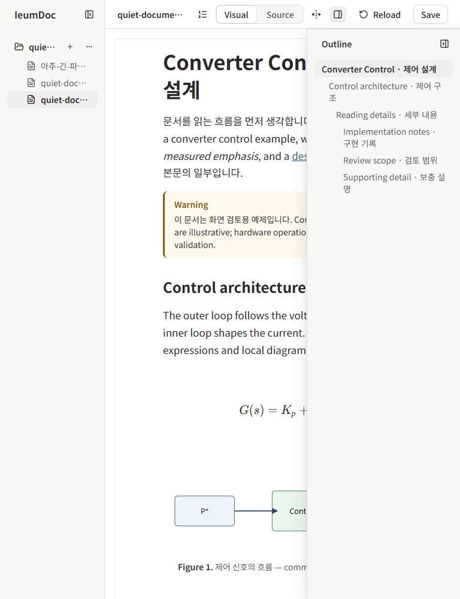 | 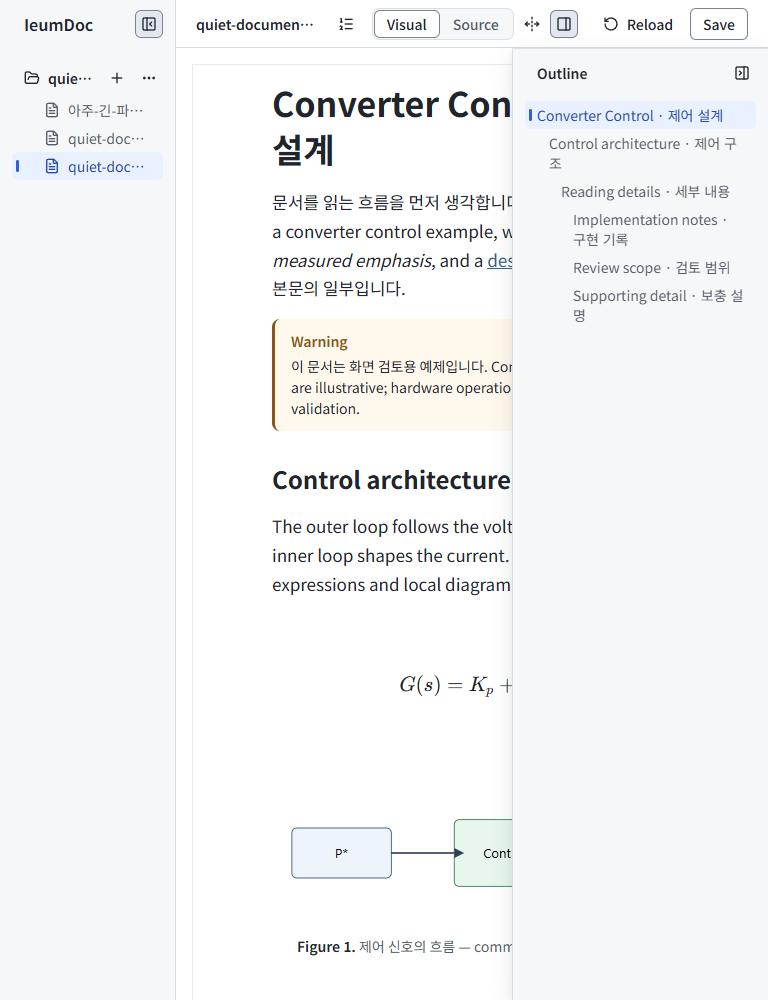 |
| Figure editing and focused input; 768px | 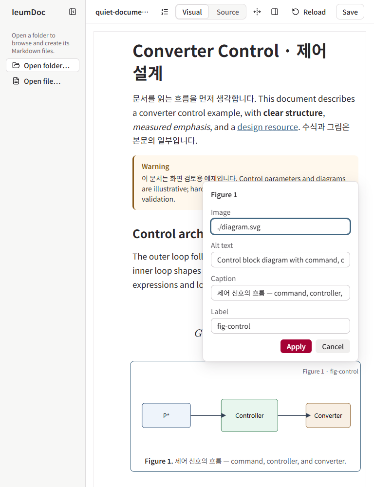 | 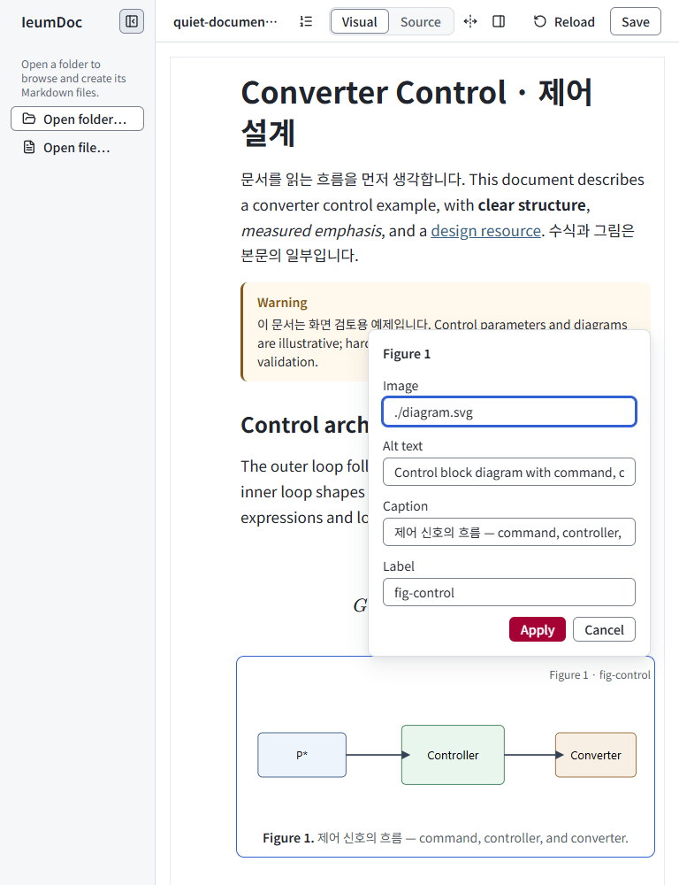 |

The untracked local evidence is in `tmp/static-ui/before/`, `tmp/static-ui/after/` and the adjacent logs/JSON. Representative original PNGs above are retained in Git. The local `capture.js` / `capture-after.js` repeat the same UI actions; `details.js` covers additional manual-review states. `quiet-document --screenshots` supplied document, collapsed Sidebar, long content and Figure/Equation form images; `folder-navigation --screenshots` supplied picker images. The runner only accepts `--screenshots` with one of those scenarios, so `layout-rules quiet-document` assertions and the two capture commands ran separately.

Additional actual After screens reviewed: empty documents at 1440/1024/768, unsaved state, Slash choice, selected text toolbar/Bold, selected/editing Table, Figure and Equation errors, Open/Folder errors, read-only content, Save failure/conflict, narrow Outline and no-hover tools. Empty is a real New scratch file. Save failure/conflict capture responses are explicitly mocked Host 400/409 responses, as in the shell regression; real external-edit conflict is covered separately by `save-session`.

## Contrast and regression evidence

| Role pair | Measured ratio |
| --- | --- |
| Main text / white | 15.55:1 |
| Secondary text / panel | 6.30:1 |
| Metadata / hover; worst checked pressed face | 4.80:1; 4.54:1 |
| Current text / selected; selected-hover | 7.12:1; 6.75:1 |
| Focus/interaction / checked adjacent surfaces | 4.55–5.65:1 |
| Control boundary / white; panel; pressed | 3.82:1; 3.57:1; 3.08:1 |
| White / heritage-red action | 7.91:1 |
| Danger / error surface | 6.57:1 |

`visual-states` uses actual computed CSS and fails if required elements/tokens are absent. Its first run against the unchanged product failed with `file: current and ordinary hover share a surface`. It checks current/hover/focus coexistence, marker shape, row geometry, shell/native-table menu-open versus hover, independent toggle state, segmented view, input error+focus, disabled Create, native/Base UI secondary consistency and Equation preview error styling. Before the capture-led corrections, added assertions failed for `Equation preview layout hides the error role` and for focusable disabled Save in `writeability-preflight`. Both passed after correction. Existing token tests retain unique, acyclic product definitions and one-way adapters.

`layout-rules` covers 1440, 1280/1279, 1025/1024, 768, 705/704px, open/collapsed Sidebar, docked/overlay Outline, local overflow and unchanged control positions. `quiet-document` covers keyboard access, focus restoration, editor selection/draft retention, Chromium Korean composition, undo/redo and real Save → Reload. CDP touch emulation (`hover:none`, one touch point) exposed tools and opened Outline with an actual dispatched touch; this is not physical touch-device certification.

Validation used Node 24.21.0 and pnpm 12.5.1. `pnpm install --frozen-lockfile`, `pnpm typecheck`, `pnpm test` (202 Core + 43 CLI + 217 Editor = 462), and `pnpm --filter @ieumdoc/editor build` passed. Editor's 217 tests, typecheck and build passed again after the capture-led corrections. Both final screenshot commands passed with source fixtures unchanged.

The first full browser run passed all 38 scenarios. A later run exposed two timing observations, retained in `tmp/static-ui/browser-final.log`: `continuous-editing` timed out with a focused editor and a collapsed selection at position 13; the unchanged scenario then passed in the focused rerun. Its cause was not established, so editor lifecycle/selection code was not changed. `quiet-document` sampled Save during its existing clean/dirty color transition; a diagnostic run recorded running color/background transitions at 54–72ms. The static contrast measurement now waits for that button's existing transitions to finish and retains the 4.5:1 threshold. No animation or product timing was changed.

The final `pnpm browser:test` passed all **38 scenarios**, including the unchanged `continuous-editing`, with no unexpected console errors or source-fixture changes (`tmp/static-ui/browser-verified.log`). `pnpm docs:check` passed (36 files, 205 local links, 28 indexed documents), and `git diff --check` passed. The requested-base comparison was rechecked against fetched `origin/master`, still `bf41fe8`.

## Limits

No actual Windows OS IME candidate-window test, physical touchscreen, macOS font rendering, Firefox or Safari run was performed. Chromium composition and touch emulation are reported only as such. The existing Vite large-chunk advisory remains; no dependency or bundle architecture was changed. Visual preference approval remains with the user.
